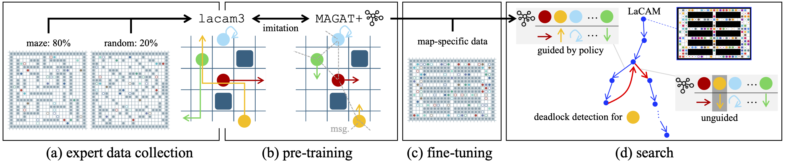

# LaGAT: Graph Attention-Guided Search for Dense Multi-Agent Pathfinding
[](https://arxiv.org/abs/2510.17382)
[](#)
[](#)
[](LICENSE)

This is the code repository for the paper ["Graph Attention-Guided Search for Dense Multi-Agent Pathfinding"](https://arxiv.org/abs/2510.17382) introducing LaGAT.
LaGAT combines a neural policy heuristic, an enhanced MAGAT+ model, with a leading search-based algorithm, LaCAM.



## News

- 13 Feb 2026: A simplified version of LaGAT implementation, called [distill-lagat](https://github.com/proroklab/distill-lagat), is available!

## Structure Overview
Parts of the algorithm implementations are taken from the [POGEMA Benchmark](https://github.com/Cognitive-AI-Systems/pogema-benchmark)
and are detailed in `pogema_benchmark/README.md`. We also take the PIBT algorithm implementation from
[PyPIBT](https://github.com/Kei18/pypibt), as detailed
in `pibt/pypibt/README.md`. LNS2 and SSIL implementations have been taken from the
[MAPF-LNS2](https://github.com/Jiaoyang-Li/MAPF-LNS2) and [ML-MAPF-with-Search](https://github.com/Rishi-V/ML-MAPF-with-Search)
repositories, respectively. The code for MAPF-GPT and LaCAM3 have been taken from
[MAPF-GPT](https://github.com/CognitiveAISystems/MAPF-GPT) and [lacam3](https://github.com/Kei18/lacam3),
respectively.

```plaintext
├── checkpoints
|      Sample checkpoints for the MAGAT+ models.
├── dataset
|      Sample dataset for training MAGAT+.
├── dcc
|      Code for DCC solver (from pogema-benchmark).
├── docker
|      Contains relevant dockerfile for running the code.
├── gpt
|      Code for MAPF-GPT, also includes our PIBT collision shielding addition.
├── lacam
|      Code for LaCAM3 (from pogema-benchmark).
├── lacam3
|      Code for LaCAM3 (from lacam3).
├── lagat
|      Our code for LaGAT.
├── lns2
|      Code for LNS2 (from MAPF-LNS2).
├── magat_plus
|      Our code for MAGAT+ training.
├── pibt
|      Code for PIBT (from PyPIBT).
├── pogema_benchmark
├── scrimp
|      Code for SCRIMP (from pogema-benchmark).
├── ssil
|      Code for SSIL (from ML-MAPF-with-Search).
|
├── grid_config_generator.py
|      Generates grid configs for testing and training.
├── README.md
├── save_maps.py
|      Saves maps for finetuning MAGAT+ and testing.
├── test_expert.py
|      Testing code for experts and non-Python MAGAT+ models.
└── test_imitation_learning_pyg.py
       Testing code for Python MAGAT+ models.
```

## Usage
The easiest way to train and test the models is to use the provided `docker/dockerfile`.
The docker file is based on the one provided by pogema-benchmark. We also provide
`docker/dockerfile_ssil` to run the SSIL evaluation.

### Training
We provide details for training and compiling the MAGAT+ model in `magat_plus/README.md`.
We provide sample checkpoints in `checkpoints`. We also provide sample datasets in `dataset`, collected
for only 50 instances for the pre-trained model and only 10 instances for the finetuned model,
due to size constraints.

### Evaluation of Pre-Trained MAGAT+ Models
The Python-based MAGAT+ models can be evaluated using `test_imitation_learning_pyg.py`.
Below we provide a sample command to run tests over a dense warehouse map.

```sh
python test_imitation_learning_pyg.py --dataset_dir /path/to/dataset --obs_radius 5 --num_samples 30000 --save_termination_state --expert_algorithm LaCAM --add_data_cost_to_go --normalize_cost_to_go --map_type mixed --obstacle_density_max 0.7 --ensure_grid_config_is_generatable --clamp_cost_to_go 1.0 --use_lists --checkpoints_dir /path/to/checkpoints/magat_plus_pretrained --run_name magat_plus_pretrained --device -1 --run_online_expert --attention_mode MAGAT_multiplicative --model_residuals all --use_edge_attr --use_edge_attr_for_messages positions+manhattan --edge_attr_processor MLP --load_positions_separately --train_on_terminated_agents --recursive_oe --cnn_mode ResNetLarge_withMLP --action_sampling_temperature 0.75 --collision_shielding pibt --action_sampling probabilistic --test_name 512ts_dense_warehouse_128 --subsample_n 128 --model_epoch_num 195 --test_num_samples 30000 --test_obs_radius 5 --test_map_type mixed --test_map_types warehouse=1.0 --test_num_agents 128+128 --test_wall_width_min 8 --test_wall_width_max 8 --test_vertical_gap 1 --test_num_wall_rows_min 5 --test_num_wall_rows_max 5 --test_num_wall_cols_min 2 --test_num_wall_cols_max 2 --test_side_pad 3 --test_max_episode_steps 512 --test_min_dist 10
```

We can also test other methods on the same test set as shown below for MAPF-GPT (85M) w/ PIBT collision shielding.

```sh
python test_expert.py --expert_algorithm MAPF-GPT-PIBT-85M --set_expert_time_limit 60 --test_name table_512ts_dense_warehouse_128 --num_samples 30000 --subsample_n 128 --obs_radius 5 --map_type mixed --map_types warehouse=1.0 --num_agents 128+128 --wall_width_min 8 --wall_width_max 8 --vertical_gap 1 --num_wall_rows_min 5 --num_wall_rows_max 5 --num_wall_cols_min 2 --num_wall_cols_max 2 --side_pad 3 --max_episode_steps 512 --min_dist 10
```

### Evaluation of LaGAT for single maps
Below we show the commands to test the LaGAT expert on the dense warehouse map with 128 agents. We also include the command
to only get the initial solution found, i.e. w/o LNS refinement.

```sh
python test_expert.py --expert_algorithm LaGAT-Det-LNS8 --lagat_model_path /path/to/checkpoints/compiled/magat_plus_dense_warehouse_finetuned_epoch_51.pt --lagat_lns_refiners 8 --test_name single_map_dense_warehouse_128 --num_samples 32 --obs_radius 5 --map_type mixed --map_types pregen=1.0 --num_agents 128+128 --max_episode_steps 4096 --min_dist 10 --map_dir /path/to/dataset/maps/dense_warehouse --num_maps 1

python test_expert.py --expert_algorithm LaGAT-Det-Init --lagat_model_path /path/to/checkpoints/compiled/magat_plus_dense_warehouse_finetuned_epoch_51.pt --test_name single_map_dense_warehouse_128 --num_samples 32 --obs_radius 5 --map_type mixed --map_types pregen=1.0 --num_agents 128+128 --max_episode_steps 4096 --min_dist 10 --map_dir /path/to/dataset/maps/dense_warehouse --num_maps 1
```

LaCAM3 and its initial solution can be computed on the same map as below.

```sh
python test_expert.py --expert_algorithm LaCAM3-30 --test_name single_map_dense_warehouse_128 --num_samples 32 --obs_radius 5 --map_type mixed --map_types pregen=1.0 --num_agents 128+128 --max_episode_steps 4096 --min_dist 10 --map_dir /path/to/dataset/maps/dense_warehouse --num_maps 1

python test_expert.py --expert_algorithm LaCAM3-Init-30 --test_name single_map_dense_warehouse_128 --num_samples 32 --obs_radius 5 --map_type mixed --map_types pregen=1.0 --num_agents 128+128 --max_episode_steps 4096 --min_dist 10 --map_dir /path/to/dataset/maps/dense_warehouse --num_maps 1
```

## Algorithms
Below we note each pre-existing algorithm included, with the links to the original repositories.

| Algorithm  | Link |
|-----------|------|
| DCC       | [https://github.com/ZiyuanMa/DCC](https://github.com/ZiyuanMa/DCC) |
| LaCAM3    | [https://github.com/Kei18/lacam3](https://github.com/Kei18/lacam3) |
| LNS2      | [https://github.com/Jiaoyang-Li/MAPF-LNS2](https://github.com/Jiaoyang-Li/MAPF-LNS2) |
| MAPF-GPT  | [https://github.com/CognitiveAISystems/MAPF-GPT](https://github.com/CognitiveAISystems/MAPF-GPT) |
| PIBT      | [https://github.com/Kei18/pypibt](https://github.com/Kei18/pypibt) |
| SCRIMP    | [https://github.com/marmotlab/SCRIMP](https://github.com/marmotlab/SCRIMP) |
| SSIL      | [https://github.com/Rishi-V/ML-MAPF-with-Search](https://github.com/Rishi-V/ML-MAPF-with-Search) |

## Citation

```bibtex
@article{jain2025lagat,
  title={Graph Attention-Guided Search for Dense Multi-Agent Pathfinding},
  author={Jain, Rishabh and Okumura, Keisuke and Amir, Michael and Prorok, Amanda},
  year={2025},
  journal={arXiv preprint arxiv:2510.17382}
}
```
